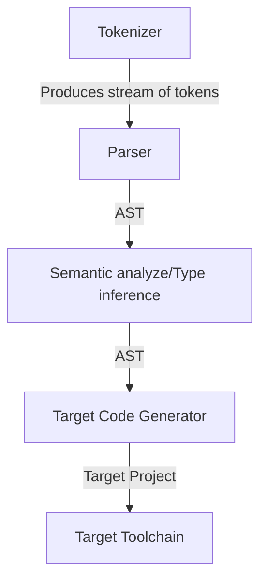

# Loki

Loki is an experimental programming language that I am building both to learn more about compilers and test ideas about language design. 

## Installation
```bash
git clone https://github.com/amirrezaask/loki.git
cd loki
zig build
```
## Compiler Flow


## [Language Spec](https://github.com/amirrezaask/loki/tree/master/spec.md)

## Plans
- C Backend as a working solution for compiling to native code.
- SSA IR
- SSA Optimizations
- LLVM Integration
