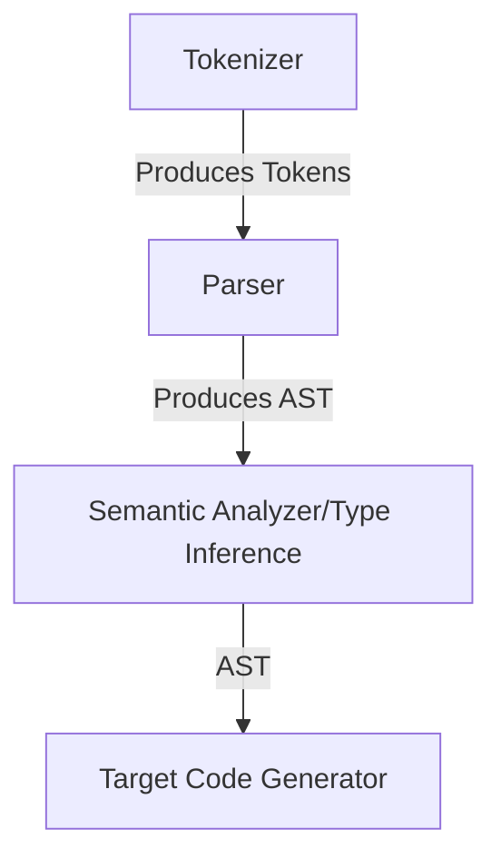

# Loki

Loki is an experimental programming language that I am building both to learn more about compilers and test ideas about language design.

## Installation

```bash
git clone https://github.com/amirrezaask/loki.git
cd loki
cargo install --path .
# if you have added cargo bins inside your path you can use loki command.
```

## Compiler Flow



## Features so far
- functions ( local functions / closures WIP )
- control flows ( if , for , while )
- file loading ( in a good way :)) )
- type inference ( cannot handle circular dependency but that's all go has anyway so I think good enough )
- loading C headers and using them ( that's how our print works )
- CPP codegen
