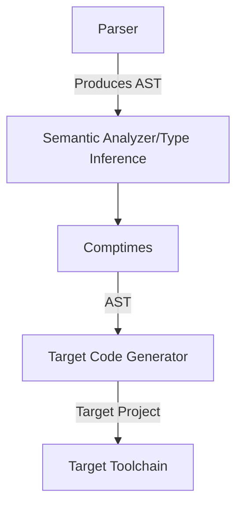

# Loki
Loki is an experimental programming language that I am building both to learn more about compilers and test ideas about language design. 

## Compiler Flow


[Language Spec](https://github.com/amirrezaask/loki/tree/master/spec.md)
## Ideas
- Loki code is *ALWAYS* just set of expressions that evaluate to a value and *ALL* expressions output must be captured.
- Error handling is done through sum types, each failable function should return a union type of the output type and error type.
- Compile time code execution is a must, both types and also values that can be evaluated at compile time.
- Types are first class values, basically compile time constants, so types are treated just like other values.
- Interface implementaions are implicit and will be check during semantic analysis.

## Platforms
Loki tries to give same experience on all supported platforms but it's not always possible, so in the standard library and any other loki code there 
can be checks(comptime if) so if a certain code cannot be compiled against target compiler just removes it and if you use a code which can not be used
in your target compiler will emit an error.


## Interopability
Loki has a direct interface to it's host programming languages so you can call directly to their libraries and apis. Both standard library and third party ones

## Build tool 
Loki has it's own build tool which is a wrapper and generator for it's target build tools. It will generate necessary files and set necessary env values
from your loki.yml file.
```
author: "amirrezaask"
name: "sample loki project"
deps:
  loki:
    - github.com/a1/lib1
  go:
    - github.com/lib/pq
```
